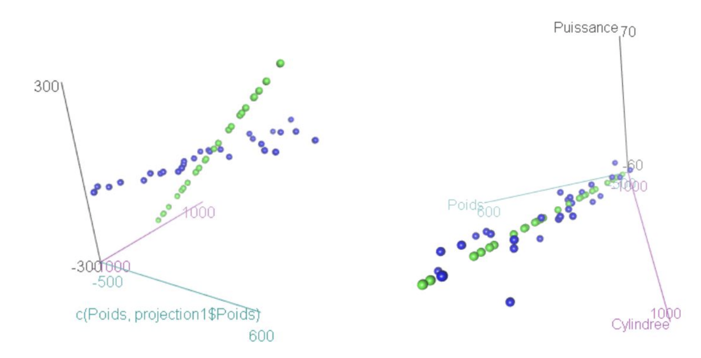

##### The goal of this course is to give you all the information you need to understand PCA, as well as give you all the tools you need to implement it. We will focus on the practical aspects of PCA without neglecting the mathematics. Each part ends with several exercises to do. Some of them are very easy and some are more difficult. I highly recommend checking all the demonstrations presented during the course, for 2 main reasons: to check for errors and to help you understand the objects manipulated. I truly believe that manipulating equations is very helpful in getting a good feel for why things are the way they are. This part contains more formal maths than usual, but I believe that you can have good understanding of PCA without a full understanding of the latter. 

<br>
<br>


> *“Statistics is about reducing the amount of data.”* **R. Fisher**


<br>

#### Premise on the mathematical tools used

You don't need to memorize all of the following, but you can refer yourself to it when you don't fully understand a calculation.

**Definitions**\
$x^j_i =$ is the value of the individual i for the variable j\
$X =$ is the matrix of our initial variables. In a sample size of n and p variables, $dim(X) = (n \times p)$.\
$Y =$ is the centered ($y_i^j = x_i - \overline{x}^j$) matrix of our initial variables.\
$Z =$ is centered reduced ($z_i^j = \frac{x_i - \overline{x}^j}{\sigma_j}$) matrix of our initial variables.\
$N = diag(\frac{1}{n})$\
$M = I_d$\
$V = Y^TNY =$ the covariance matrix\
$R = Z^TNZ =$ the correlation matrix\

**Some properties**\
- $Proj(a) = Pa = uu^Ta = b$, where $Proj(a)$ is the projection of $a$ on the subspace generated by $u$\
- $\left\| y^j\right\|_N = \sqrt{<y^j,y^j>_N} = \sqrt{(y^j)^TNy^j} = \sigma_j$, where $mean(y^j) = \overline{y}^j = 0$\
- $cor(x,y) = cos\theta(x,y) = \frac{<x,y>}{\left\| x\right\| \left\| y\right\|}$\

**Inertia**\
The total inertia of a scatter plot is measured as the sum of the squares of the distances of the points from the center of gravity. Assuming all variables and individuals have the same weight compared to each other ($N = diag(n_i) = diag(\frac{1}{n})$ and $M = I_d$), we can formally describe inertia as follow: $$I_g = \sum_{1}^{n} n_i \left\| x_i - g\right\|_M^2$$
$$= \sum_{1}^{n} n_i (x_i - g)^TM(x_i - g)$$
$$= \sum n_i <x_i-g,x_i-g>_M$$
$$= \sum_{1}^{n} n_i <y_i,y_i>_M$$
$$= \sum_{1}^{n} n_i y_i^T M y_i$$
Assuming $x$ is centered (i.e: $mean(x) = 0$), we have:
$$I_g = \sum_{1}^{n} n_i x_i^TMx_i = \frac{1}{n} \sum_{1}^{n} \sum_{1}^{p} (x_i^j)^2 = \sum_{1}^{p} Var(x^j)$$

We will try to represent this scatter plot in $\mathbb{R}^d$ by projecting it on a subspace of dimension $d < p$ such that the scatter plot of projected points distorts as little as possible the distances compared to the initial distances. And we will see that we will necessarily lose inertia. Put more formally, we want to project this scatter plot is a sub-space that maximizes the projected inertia. 

<br>
<br>

#### How our variables are projected?

The goal of PCA is to reduce the number of dimensions of our data set: we want to summarize the more information possible by projecting our variables into the first few principal components. These latters are defined as:\
*"The principal components of a collection of points in a real coordinate space are a sequence of $p$ unit vectors, where the $i$-th vector is the direction of a line that best fits the data while being orthogonal to the first $i-1$ vectors"* ([Wikipedia](https://en.wikipedia.org/wiki/Principal_component_analysis)).

We want to project our variables in a specific way. Based on your intuition, which one of the following projections (green points) is the best? 



<br>

**Projection in a sub-space of dimension 1**\
As said before, we want to project a scatter plot is a sub-space that maximizes the projected inertia. This essentially means that doing a PCA is equivalent as solving an optimization problem, formally describe as follow: $$u = Arg~max~I_{projected} = Arg~max \sum_{1}^{n} \left\| Py_i\right\|^2_M$$
$$subject~to:~u~\in~\mathbb{R}^p,~\left\| u\right\|_M=1$$
With $P$ an M-orthogonal projector on a subspace of dimension $1$, generated by a vector $u$, M-orthonormal: $u^TMu = 1$. The projector is written so: $P = uu^TM$.

Solving this problem is obtained for the largest eigenvector of the matrix $VM$: it suffices to take an M-orthonormal vector of $VM$ associated to the largest eigenvalue $\lambda_1$ of $VM$. 

<br>

**Projection in a sub-space of dimension d**\
Generalization of the last problem is equivalent to determines the d largest eigenvalues $\lambda_1, \cdots, \lambda_d$ of $VM$. This is the same as diagonalizing the square matrix $VM$: $$VM = S^T\Lambda S = \sum_{k=1}^{p} \lambda_k u_k u_k^TM$$
With $S = [u_1, \cdots, u_p]$. We choose the d largest in order to defines the optimal projector. 

<br>

**Principal components**\
[Wikipedia](https://en.wikipedia.org/wiki/Principal_component_analysis) description of principal components is great:\
*"In data analysis, the first principal component of a set of $p$ variables, presumed to be jointly normally distributed, is the derived variable formed as a linear combination of the original variables that explains the most [inertia]. The second principal component explains the most [inertia] in what is left once the effect of the first component is removed, and we may proceed through $p$ iterations until all the [inertia] is explained. PCA is most commonly used when many of the variables are highly correlated with each other and it is desirable to reduce their number to an independent set."*.

In this course, we define the **first principal component** as follow: $$\Psi_1 = YMu_1$$
*With* $$Var(\Psi_1) = \left\| \Psi_1\right\|^2_N$$
$$= <\Psi_1, \Psi_1>_N = \Psi_1^TN\Psi_1$$
$$= (YMu_1)^TNYMu_1$$
$$= u_1^TMY^TNYMu_1$$
$$= u_1^TM(VMu_1) = u_1^TM(\lambda_1u_1)$$
$$= \lambda_1(u_1^TMu_1) = \lambda_1$$

One last thing important for the next part: we can calculate the correlation between a variable and a principal component. If the correlation is strong, it means that the principal component mainly *represents* the variable in question. More formally, we can describe it this way: $$cor(x^j,\Psi_{d}) = cos\theta(x,\Psi_{d})$$

<br>
<br>

#### Importance of normalization

In this course, we have talked multiple times of centered reduced variables without explanation. If you have a really good intuition (or already know about PCA), you might have an idea of why this is important. We said that PCA consists in solving an optimization problem where we want to maximize projected inertia. The other important fact is that inertia is the sum of all the variances of our initial data set (for centered variables). You get it?

Let's take a concrete example with the iris data set! In the latter, all variables are in cm, **but I will change one of them in tens of mm**.\

```{r echo=TRUE, message=FALSE, warning=FALSE, fig.width=10}
data("iris")
data = iris[, 1:4] #remove the qualitative variable
data$Petal.Width = data$Petal.Width*10 #Petal.Width is now in tens of cm 
summary(data)

library(FactoMineR)
#explicit that we don't want to normalize our data (i.e: center-reduce)
pca_results = PCA(data, graph = FALSE, scale.unit = FALSE) 
plot.PCA(pca_results, choix = "var")
```

This seems like petal width is different than other variables, but where does it come from? When R is computing the eigenvalue associated to the first principal component (= maximizing projected inertia), **it uses the covariance matrix**. But because variables are not on the same scale, each variable will a have a weight equivalent to the scale of its variance. Because petal width variance is in a higher scale, the **first principal component and itself are very correlated**. The weight of petal width is very important compared to the other variables. Does this means that we can only do PCA on variables that are on the same scale? Yes (not exactly right, but doesn't really matters here). But it's very easy to transform our initial variables into new ones that are on the same scale: center-reduction. The latter has some very useful properties.

```{r echo=TRUE, message=FALSE, warning=FALSE}
data("iris")
iris$Sepal.Length2 = scale(iris$Sepal.Length)
```

```{r echo=FALSE, message=FALSE, warning=FALSE}
cat("Mean (SD) of sepal lenght:",
    mean(iris$Sepal.Length),
    "(",sd(iris$Sepal.Length),")",
    "\nMean (SD) of centered-reduced sepal lenght:",
    round(mean(iris$Sepal.Length2)),
    "(",sd(iris$Sepal.Length2),")")
```

Centered-reduced variables always have, by definition, a **mean of $0$ and standard deviation of $1$**. By doing this transformation on our initial data set, we ensure that none of the variables will have a different weight than others when solving the optimization problem. By default, `PCA()` function from R normalize all the variables, but it's important than you understand why we do this. You will see that this also has a **particular importance during results interpretation**. 

To summary: we compute **eigenvalues of the correlation matrix and not the covariance one** in order to put all variables on the same scale, which gives them the same weight. If we don't do it, the variables that are on a higher scale will be the only variables that are well projected. In fact, **maximizing projected inertia will essentially maximizes projected inertia of these variables**. 

```{r echo=TRUE, message=FALSE, warning=FALSE, fig.width=10}
data("iris")
data = iris[, 1:4] #remove the qualitative variable

library(FactoMineR)
#explicit that we want to normalize our data
pca_results = PCA(data, graph = FALSE, scale.unit = TRUE) 
plot.PCA(pca_results, choix = "var") 
```

<br>
<br>

#### Exercises

> 1.
In R, what is the difference between `cor(X)`, `cor(Y)` and `cor(Z)`? Why so?

> 2.
With R, on the iris data set, check if there is any difference between `cor(Z)` ($Z$ is the matrix of the centered reduced inital data) and $Z^TNZ$ (the symbol for matrix multiplication in R is `%*%`). What's the cause of that?

> 3.
What is the total inertia of a scatter plot of point-individuals when the variables are centered reduced? Prove it from: $I_g(X) = \frac{1}{n}\sum \left\|y_i \right\|^2$

> 4.
What can we say about orthonality and correlation? You can use the example of Sepal.Width-Sepal.Length and Petal.Width-Petal.Length from above to illustrate. Is is consistent with computing `cor(iris$Sepal.Width, iris$Sepal.Length)` and `cor(iris$Petal.Width, iris$Petal.Length)`?

> 5.
Knowing that inertia is the sum of the variances of a data set, describe it as the trace of a matrix. 

> 6.
Solving the problem of maximizing the projected inertia is equivalent to do what?

> 7.
*With your own words*, make a short description of what PCA is and how it works.

<br>
<br>
<br>
<br>